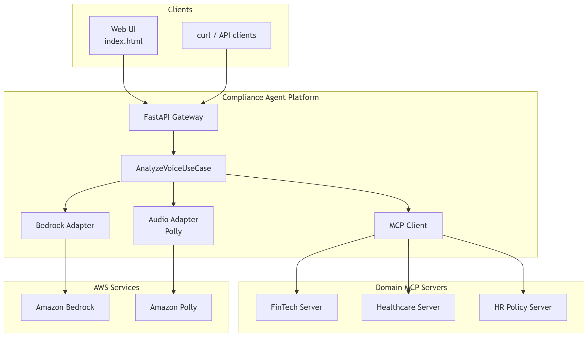
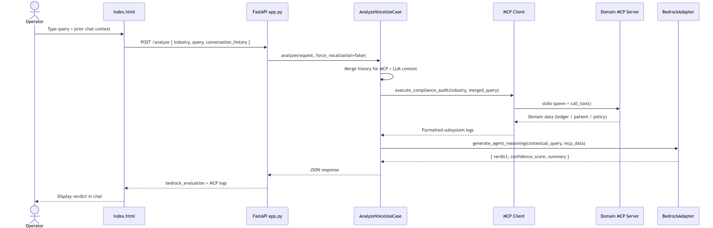
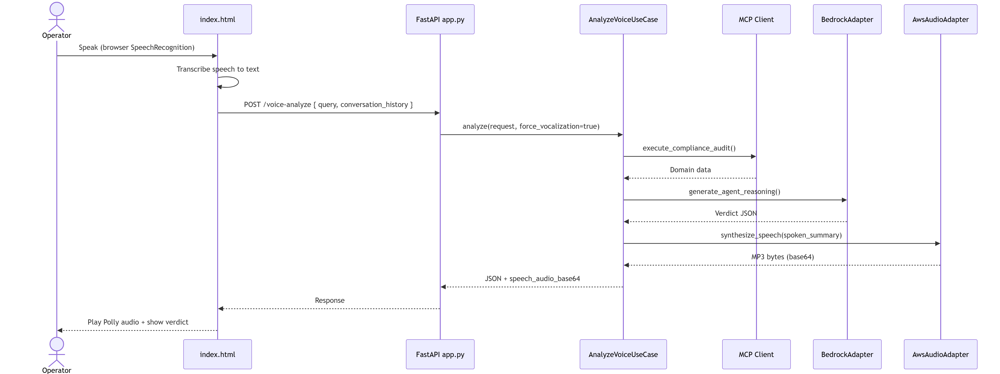
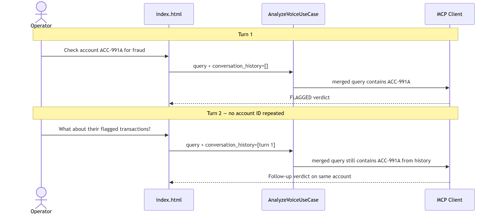

# SentryMCP


**Multi-domain compliance agent** — ask audit questions in plain English or by voice, route to the right subsystem via **MCP**, get a structured verdict from **AWS Bedrock**, hear it aloud with **Amazon Polly**.

| | |
|---|---|
| **Stack** | Python · FastAPI · MCP · Bedrock · Polly |
| **Domains** | FinTech · Healthcare · HR |
| **Pattern** | Clean / Hexagonal architecture (ports & adapters) |

> 🎬 **Demo:** *(docs/images/lld-text-analyze.png)*

---

## Table of Contents

- [Why](#why)
- [What](#what)
- [Architecture](#architecture)
- [Prerequisites](#prerequisites)
- [Quick Start with Docker](#quick-start-with-docker)
- [Setup & Installation](#setup--installation)
  - [1. Clone the repo](#1-clone-the-repo)
  - [2. Create virtual environment](#2-create-virtual-environment)
  - [3. Install dependencies](#3-install-dependencies)
  - [4. Configure environment variables](#4-configure-environment-variables)
  - [5. Run the server](#5-run-the-server)
- [Running Modes](#running-modes)
  - [Local mode (no AWS)](#local-mode-no-aws)
  - [Bedrock mode (AWS)](#bedrock-mode-aws)
- [Usage](#usage)
- [Sample Output](#sample-output)
- [Project Layout](#project-layout)
- [API Reference](#api-reference)
- [Tests](#tests)
- [Troubleshooting](#troubleshooting)
- [Documentation](#documentation)

---

## Why

Compliance teams jump between **siloed systems** — ledgers, patient records, HR policies. Checks are slow, inconsistent, and hard to audit. SentryMCP gives **one interface** for natural-language compliance triage with **explainable JSON verdicts** (`CLEARED` · `FLAGGED` · `ACTION_REQUIRED`).

---

## What

- **Text or voice** audits through a built-in web UI (`GET /`)
- **MCP routing** to domain-specific tools (mock data in this POC)
- **LLM reasoning** with Bedrock + free-model fallback chain
- **Multi-turn chat** — follow-ups like *"What about their flagged transactions?"* keep context
- **Voice-to-voice** — browser speech recognition in, Polly TTS out

**30-second architecture view:**

```text
Operator → Web UI / API → FastAPI → AnalyzeVoiceUseCase
    → MCP server (FinTech | Healthcare | HR)
    → Bedrock LLM → structured verdict → (optional) Polly TTS
```

---

## Architecture

Core business logic in the center; HTTP, MCP, and AWS at the edges.
New industries = new MCP server, no core rewrite needed.

### HLD — System Overview



### LLD — Sequence Flows

| Flow | Diagram |
|------|---------|
| Text chat |  |
| Voice + Polly |  |
| Conversation memory |  |

---

## Prerequisites

Make sure you have the following installed before starting:

| Requirement | Version | Check |
|---|---|---|
| Python | 3.11+ | `python --version` |
| pip | latest | `pip --version` |
| Git | any | `git --version` |
| AWS CLI *(optional, Bedrock mode only)* | v2+ | `aws --version` |

> **No AWS account?** Run in [Local mode](#local-mode-no-aws) — no cloud setup needed.

---

## Quick Start with Docker

The fastest way to run SentryMCP — no Python setup needed.

**Prerequisites:** [Docker Desktop](https://www.docker.com/products/docker-desktop/) installed and running.

### Local mode (no AWS)

```bash
# 1. Clone
git clone https://github.com/krsatyam99/SentryMCP.git
cd SentryMCP

# 2. Copy env file (defaults to local mode — no AWS needed)
cp .env.example .env        # macOS/Linux
copy .env.example .env      # Windows

# 3. Build and run
docker compose up --build
```

Open **http://localhost:8000/** — done. ✅

### Bedrock + Polly mode (AWS)

```bash
# Edit .env first
LLM_PROVIDER=bedrock
POLLY_ENABLED=true
AWS_ACCESS_KEY_ID=your_key
AWS_SECRET_ACCESS_KEY=your_secret

# Then run
docker compose up --build
```

### Dev mode (hot reload)

```bash
docker compose --profile dev up sentrymcp-dev
```

Server runs on **http://localhost:8001/** and reloads on code changes.

### Useful Docker commands

```bash
# Run in background
docker compose up -d

# View logs
docker compose logs -f

# Stop
docker compose down

# Rebuild after dependency changes
docker compose up --build
```

---

## Setup & Installation

### 1. Clone the repo

```bash
git clone https://github.com/krsatyam99/SentryMCP.git
cd SentryMCP
```

### 2. Create virtual environment

**Windows (PowerShell):**
```powershell
python -m venv .venv
.venv\Scripts\activate
```

**macOS / Linux:**
```bash
python -m venv .venv
source .venv/bin/activate
```

You should see `(.venv)` in your terminal prompt.

### 3. Install dependencies

```bash
pip install -r requirements.txt
pip install -e .
```

### 4. Configure environment variables

Copy the example env file and fill in your values:

**Windows:**
```powershell
copy .env.example .env
```

**macOS / Linux:**
```bash
cp .env.example .env
```

Then open `.env` and set your values:

```env
# ── LLM Provider ─────────────────────────────────────────
# Use "local" for free OpenRouter fallback (no AWS needed)
# Use "bedrock" for AWS Bedrock (requires AWS credentials below)
LLM_PROVIDER=local

# ── Voice Output ─────────────────────────────────────────
# Set to true to enable Amazon Polly TTS (requires AWS credentials)
POLLY_ENABLED=false

# ── AWS Credentials (only needed for bedrock or Polly) ───
AWS_ACCESS_KEY_ID=your_access_key_here
AWS_SECRET_ACCESS_KEY=your_secret_key_here
AWS_DEFAULT_REGION=us-east-1

# ── Bedrock Model ─────────────────────────────────────────
BEDROCK_MODEL_ID=amazon.nova-micro-v1:0
```

### 5. Run the server

```powershell
# Windows
$env:PYTHONPATH = "src"
python -m uvicorn agentai.adapters.inbound.api.app:app --host 0.0.0.0 --port 8000
```

```bash
# macOS / Linux
PYTHONPATH=src python -m uvicorn agentai.adapters.inbound.api.app:app --host 0.0.0.0 --port 8000
```

You should see:
```
INFO:     Started server process [xxxx]
INFO:     Application startup complete.
INFO:     Uvicorn running on http://0.0.0.0:8000
```

Open **http://localhost:8000/** in Chrome or Edge.

---

## Running Modes

### Local mode (no AWS)

No AWS account needed. Uses a free OpenRouter model fallback chain.

```env
LLM_PROVIDER=local
POLLY_ENABLED=false
```

> Note: Free models may be rate-limited or return slower responses.

### Bedrock mode (AWS)

Full production-like setup with AWS Bedrock for LLM reasoning and Polly for voice output.

**Step 1 — Configure AWS credentials:**
```powershell
# Windows PowerShell
$env:AWS_ACCESS_KEY_ID="your_access_key"
$env:AWS_SECRET_ACCESS_KEY="your_secret_key"
$env:AWS_DEFAULT_REGION="us-east-1"
```

Or use the AWS CLI:
```bash
aws configure
```

**Step 2 — Set env vars:**
```env
LLM_PROVIDER=bedrock
POLLY_ENABLED=true
BEDROCK_MODEL_ID=amazon.nova-micro-v1:0
```

**Step 3 — Ensure your IAM user has these permissions:**
- `bedrock:InvokeModel`
- `polly:SynthesizeSpeech`

---

## Usage

| URL | Purpose |
|-----|---------|
| http://localhost:8000/ | Web UI (chat + voice) |
| http://localhost:8000/docs | Interactive API explorer |

**Try these sample queries:**

```
# FinTech
Check account ACC-991A for possible fraud
What about their flagged transactions?

# Healthcare
Check patient PAT-204B for compliance risk

# HR
What is the data privacy policy?
Summarize the whistleblower policy
```

---

## Sample Output

```json
{
  "verdict": "FLAGGED",
  "confidence": 0.91,
  "domain": "fintech",
  "account": "ACC-991A",
  "reason": "Offshore transaction TX-302 ($95,000) flagged for manual review. Compliance status: UNDER_REVIEW.",
  "compliance_note": "CRITICAL: Escalate to compliance officer within 24 hours.",
  "mcp_source": "fintech_server"
}
```

Verdict values:

| Verdict | Meaning |
|---|---|
| `CLEARED` | No compliance issues detected |
| `FLAGGED` | Suspicious activity — review recommended |
| `ACTION_REQUIRED` | Immediate escalation needed |

---

## Project Layout

```text
SentryMCP/
├── backend/
│   └── mcp_servers/          # Domain MCP plugins (stdio transport)
│       ├── fintech_server.py
│       ├── healthcare_server.py
│       └── hr_server.py
├── src/agentai/
│   ├── core/                 # Entities, ports, use cases (pure Python)
│   ├── adapters/
│   │   ├── inbound/          # FastAPI routes
│   │   └── outbound/         # MCP client, Bedrock, Polly adapters
│   └── static/               # Web UI (index.html)
├── docs/                     # Technical guide (DOCX) + diagrams
├── tests/
├── Dockerfile
├── docker-compose.yml
├── .dockerignore
├── .env.example
├── requirements.txt
└── setup.py
```

---

## API Reference

Full interactive docs at **http://localhost:8000/docs**

**POST** `/analyze`

```json
{
  "industry": "fintech",
  "query": "Check account ACC-991A for possible fraud"
}
```

Response: structured verdict JSON (see [Sample Output](#sample-output))

---

## Tests

```bash
pytest
```

```bash
# With coverage
pytest --cov=src/agentai tests/
```

---

## Troubleshooting

**`claude` or `uvicorn` not recognized:**
```powershell
# Refresh PATH in current session
$env:PATH += ";C:\Users\<you>\.local\bin"
```

**Port 8000 already in use:**
```powershell
netstat -ano | findstr :8000
taskkill /PID <PID> /F
```

**AWS credentials error:**
- Confirm `AWS_ACCESS_KEY_ID` and `AWS_SECRET_ACCESS_KEY` are set correctly
- Check IAM permissions include `bedrock:InvokeModel` and `polly:SynthesizeSpeech`
- Switch to `LLM_PROVIDER=local` to test without AWS

**Free model rate limit (429):**
- Expected behavior — the system falls back automatically through the model chain
- Switch to `LLM_PROVIDER=bedrock` for reliable responses

**MCP server not found:**
- Ensure you ran `pip install -e .` from the repo root
- Check `PYTHONPATH=src` is set before running uvicorn

---

## Documentation

For deep-dive technical reference (architecture decisions, MCP plug-in guide, full API, AWS setup, demo script):

📄 **[docs/SentryMCP-Technical-Guide.docx](docs/SentryMCP-Technical-Guide.docx)**

Open in Microsoft Word or Google Docs.

---

**Package:** `cross-industry-voice-dataguard` v0.1.0  
**Built with:** Python · FastAPI · MCP · AWS Bedrock · Amazon Polly
